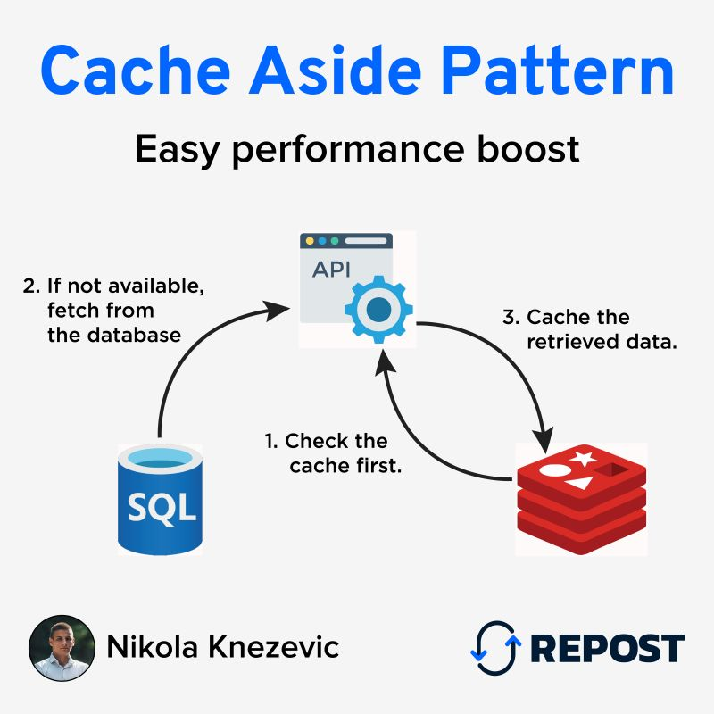

# Тестовое задание для Soft Media Group

## ТЗ: Проектирование системы с кешированием
Спроектировать и частично реализовать API для блога с кешированием популярных постов

--- 
Что должно быть

1. CRUD для постов: создать, получить, обновить, удалить
2. При GET /posts/{id} проверять наличие поста в Redis, если нет — брать из PostgreSQL и класть в кеш
3. При обновлении или удалении поста инвалидировать кеш
4. Написать интеграционный тест для проверки логики кеширования
---
Сдача

Код на GitHub + схема архитектуры (можно фото) + объяснение почему выбрал такой подход к кешированию

---

Общие требования

· Код запускается
· Ключи и настройки в .env
· README с шагами по установке и запуску тестов

Критерии оценки

· Чистота и структура кода
· Понимание REST
· Работа с БД и индексами
· Наличие и качество тестов
· Обработка ошибок


---
# Схема работы приложения 
> Для кэширования использовалась стратегия Cache-aside: сначала выполняется попытка получить данные из кэша, и только при их отсутствии происходит обращение к базе данных. После получения данных из БД они сохраняются в кэш для последующих запросов.

## Диаграмма работы Cache-Aside


# Как запустить
## Установите Make (GNU Make) в Linux
 
> Устанавливается утилита **make**, которая выполняет инструкции из Makefile.

---

## Установка make

### Ubuntu / Debian

```bash
sudo apt update
sudo apt install make
```

### Fedora

```bash
sudo dnf install make
```

### ArchLinux

```bash
sudo pacman -S make
```

---

## Установка docker и docker-compose

>Способ установки docker и docker-compose описан на официальном сайте по ссылке [Официальный сайт Docker](https://docs.docker.com/compose/install/)

## Запуск проекта

Для удобства был написан Makefile.

Для просмотра всех доступных команд:
```bash
sudo make help
```

Для запуска docker-compose:
```bash
sudo make build
```

Для удаления всех контейнеров и volume`ов:
```bash
sudo make down
```

Для запуска тестов:
```bash
sudo make test
```

# Документация API
>Ссылки работают только после выполнения команды `sudo make build`

Документация к API доступна по адресу:

http://localhost:8000/api/v1/documentation/

Так же для удобного отслеживания кэша был добавлен redis-insight. Перейти в него можно по ссылке:

http://localhost:5540/